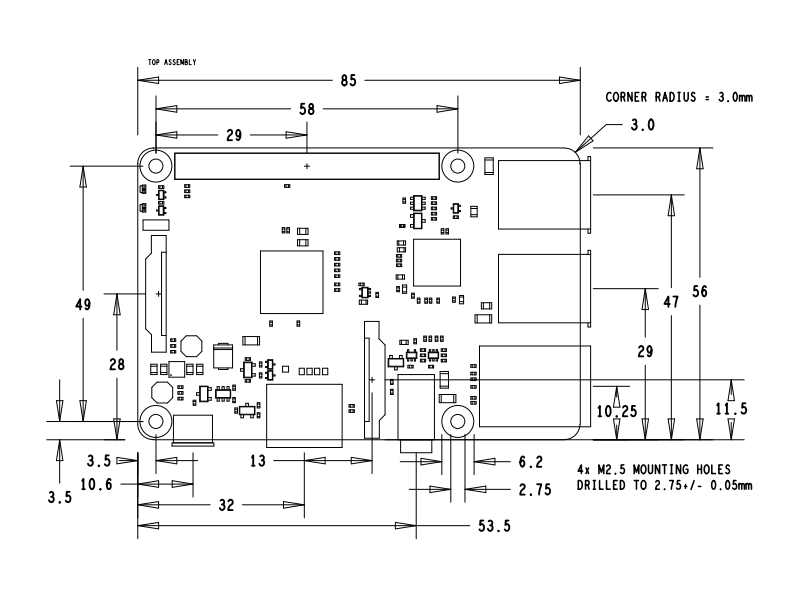
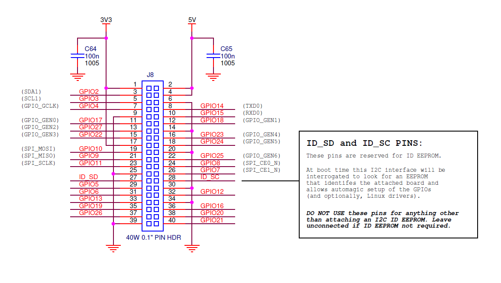
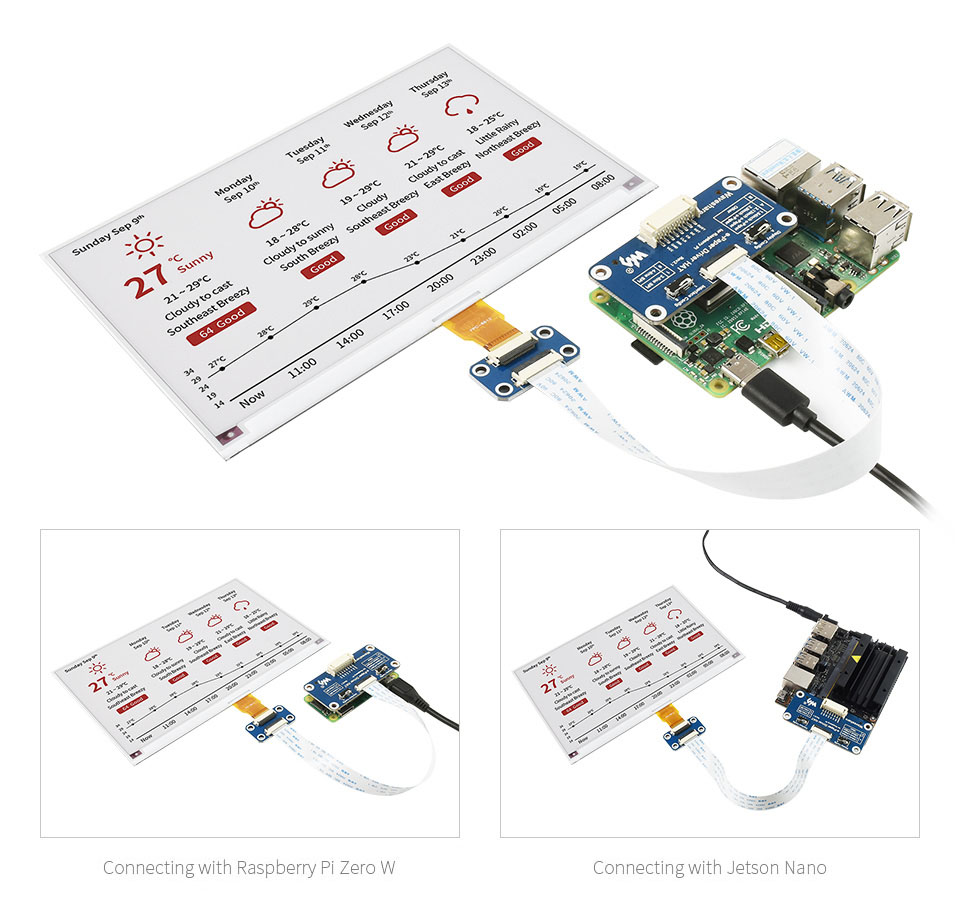
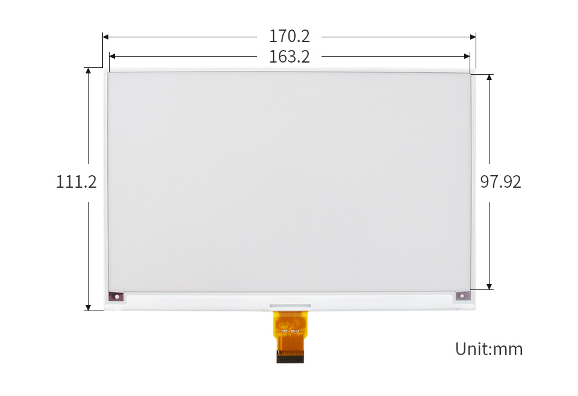
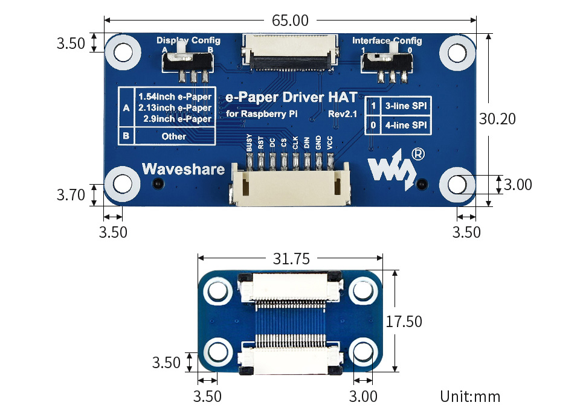

# eink_explorations
Having some fun with waveshare 7.5inch e-ink panel and Raspberry Pi

# Hardware

## Raspberry Pi 3 Model B+ Revision03

https://www.raspberrypi.org/products/raspberry-pi-3-model-b-plus/

- Broadcom BCM2837B0, Cortex-A53 (ARMv8) 64-bit SoC @ 1.4GHz
- 1024MB LPDDR2 SDRAM
- 2.4GHz and 5GHz IEEE 802.11.b/g/n/ac wireless LAN, Bluetooth 4.2, BLE
- Full-size HDMI (Good for debug / dev monitor)
- Power supply: +5 V @ 2.5 A via microUSB jack
- Dimensions: 85 x 56 x 17 mm
- 4 USB 2.0 ports

### Dimensions



### Pin Out



### RPi Installation guide:

[Installing OS on RPi](https://projects.raspberrypi.org/en/projects/raspberry-pi-setting-up)

[Setting up a Raspberry Pi WiFi headless](https://www.raspberrypi.org/documentation/configuration/wireless/headless.md) (`wpa_supplicant.conf` in boot)

[Enabling SSH on Raspberry Pi Without a Screen](https://linuxize.com/post/how-to-enable-ssh-on-raspberry-pi/) (empty file named `ssh` in boot)

[Using MMAP to find the RPi on same network](https://www.raspberrypi.org/documentation/remote-access/ip-address.md) (`nmap -sn 192.168.88.0/24`)

Connect via SSH:  `ssh pi@192.168.88.63`

The default user is **pi** , and the password is **~~raspberry~~** .

[Keep RPi connected to WiFi](https://francisuniverse.wordpress.com/2018/01/07/how-to-automatically-reconnect-raspberry-pi-to-wifi/) (Following the second method by installing `ifplugd` )

### Linux Commands

List USB Devices: `lsusb `

System Log: `dmesg`


## Waveshare 800 x 480 RBW tricolour 7.5 inch e-ink panel

[7.5inch E-Paper E-Ink Display HAT (B) For Raspberry Pi, 800×480, Red / Black / White, SPI](https://www.waveshare.com/product/displays/e-paper/epaper-1/7.5inch-e-paper-hat-b.htm)



- power supply 3.3V/5V
- 3-wire SPI, 4-wire SPI
- external dimension 170.2 × 111.2mm
- Display size 163.2 × 97.92mm
- Dot Pitch 0.205 × 0.204mm
- Greyscale 2
- Refresh 16s

### Dimension





### Library Setup Guide

[e-paper hat wiki](https://www.waveshare.com/wiki/7.5inch_e-Paper_HAT_(B))

```
wget http://www.airspayce.com/mikem/bcm2835/bcm2835-1.60.tar.gz
tar zxvf bcm2835-1.60.tar.gz 
cd bcm2835-1.60/
sudo ./configure
sudo make
sudo make check
sudo make install
```

Install library for using Rpi GPIO

```
sudo apt-get install wiringpi
cd /tmp
wget https://project-downloads.drogon.net/wiringpi-latest.deb
sudo dpkg -i wiringpi-latest.deb
gpio -v
```

Install Python Dependency and Git

```
#python3
sudo apt-get update
sudo apt-get install python3-pip
sudo apt-get install python3-pil
sudo apt-get install python3-numpy
sudo pip3 install RPi.GPIO
sudo pip3 install spidev
sudo apt-get install git -y
```

Update Pillow to latest version (Has more drawing effects)

```
python3 -m pip install --upgrade Pillow
```

Clone Waveshare Examples and E-Ink Library. 


```
# Examples Python
sudo git clone https://github.com/waveshare/e-Paper

cd /e-Paper/RaspberryPi_JetsonNano/python/examples/
sudo python3 epd_7in5b_V2_test.py
```

The e-ink library at `/e-Paper/RaspberryPi_JetsonNano/python/lib`is not installed into the python path, but dynamically added to `sys.path` when the actual file is run:

```
import os
import sys
libdir = "/e-Paper/RaspberryPi_JetsonNano/python/lib"
if os.path.exists(libdir):
    sys.path.append(libdir)
from waveshare_epd import epd7in5b_V2
```


### Case Design

RPi 3 B 3D Model

https://grabcad.com/library/raspberry-pi-3-model-b-reference-design-solidworks-cad-raspberry-pi-raspberrypi-rpi-1

# Software 

## Coding and editing via VSCode

[Guide for setting up VSCode to connect remotely to RPi](https://www.raspberrypi.org/blog/coding-on-raspberry-pi-remotely-with-visual-studio-code/) (Install **Remote Development** extension)

[Workaround](https://stackoverflow.com/a/65156180/3199029) - Changing the repo folder for SSH read write permission for default account:``sudo setfacl -R -m u:pi:rwx ~/eink_explorations/ ``

## Functional Python Example File

https://github.com/waveshare/e-Paper/blob/master/RaspberryPi_JetsonNano/python/examples/epd_7in5_V2_test.py

Python file location

```
cd ~/eink_explorations/src/main.py
```

`waveshare_epd` Library location

```
```

## Cron job

Set up `main.py` in the repo to be [run as cron job](https://www.raspberrypi.org/documentation/linux/usage/cron.md) by entering `sudo crontab -e`

The following line runs `main.py` on reboot and output `stdout` is routed to `log.txt`. 

```
@reboot sudo python3 /home/pi/eink_explorations/src/main.py > /home/pi/eink_explorations/log.txt
```

The following line runs the same file every 10 mins from hour 6 through 23:

```
0,59/10 6-23 * * * sudo python3 /home/pi/eink_explorations/src/main.py > /home/pi/eink_explorations/log.txt
```

Last run log can be seen in:

```
sudo nano ~/eink_explorations/log.txt
```


Boot log can be seen in:

```
grep cron /var/log/syslog
```

